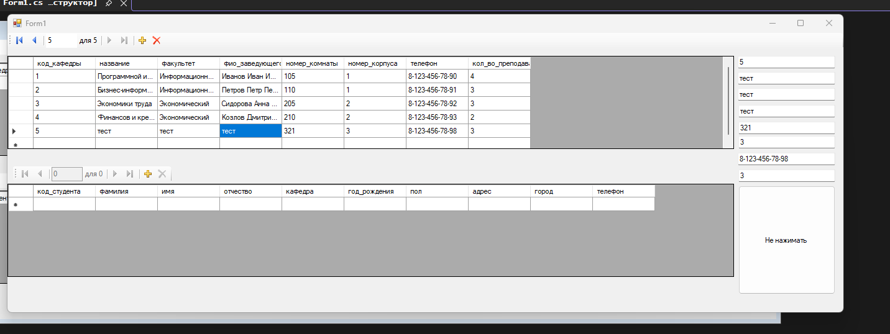
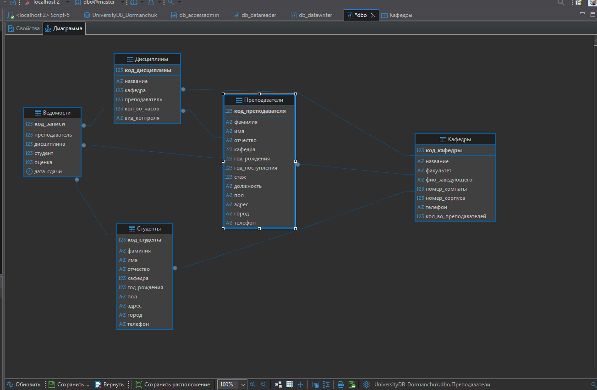
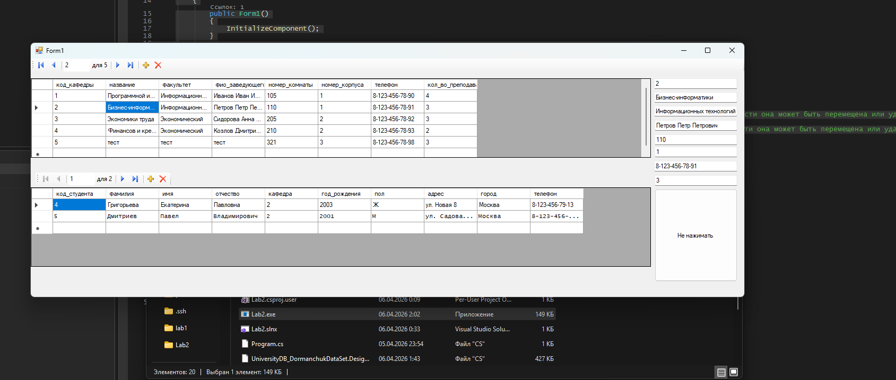

```C#
using System;
using System.Collections.Generic;
using System.ComponentModel;
using System.Data;
using System.Drawing;
using System.Linq;
using System.Text;
using System.Threading.Tasks;
using System.Windows.Forms;

namespace Lab2
{
    public partial class Form1 : Form
    {
        public Form1()
        {
            InitializeComponent();
        }

        private void dataGridView1_CellContentClick(object sender, DataGridViewCellEventArgs e)
        {

        }

        private void Form1_Load(object sender, EventArgs e)
        {
            // TODO: данная строка кода позволяет загрузить данные в таблицу "universityDB_DormanchukDataSet.Студенты". При необходимости она может быть перемещена или удалена.
            this.студентыTableAdapter.Fill(this.universityDB_DormanchukDataSet.Студенты);
            // TODO: данная строка кода позволяет загрузить данные в таблицу "universityDB_DormanchukDataSet.Кафедры". При необходимости она может быть перемещена или удалена.
            this.кафедрыTableAdapter.Fill(this.universityDB_DormanchukDataSet.Кафедры);
        }

        private void bindingNavigator2_RefreshItems(object sender, EventArgs e)
        {

        }

        private void bindingNavigator1_RefreshItems(object sender, EventArgs e)
        {

        }

        private void button1_Click(object sender, EventArgs e)
        {
            кафедрыTableAdapter.Update(universityDB_DormanchukDataSet.Кафедры);
            студентыTableAdapter.Update(universityDB_DormanchukDataSet.Студенты);
        }
    }
}
```




