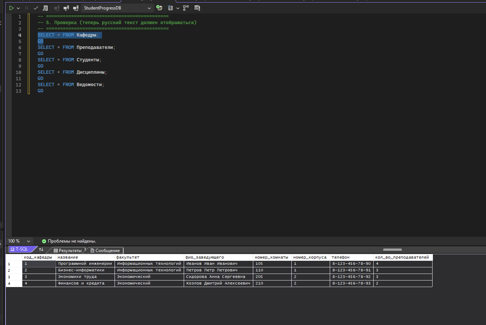
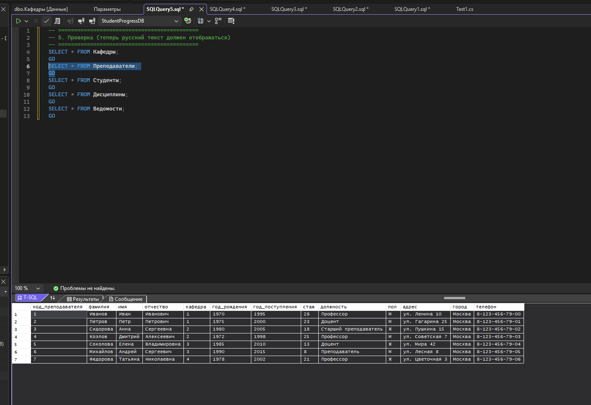
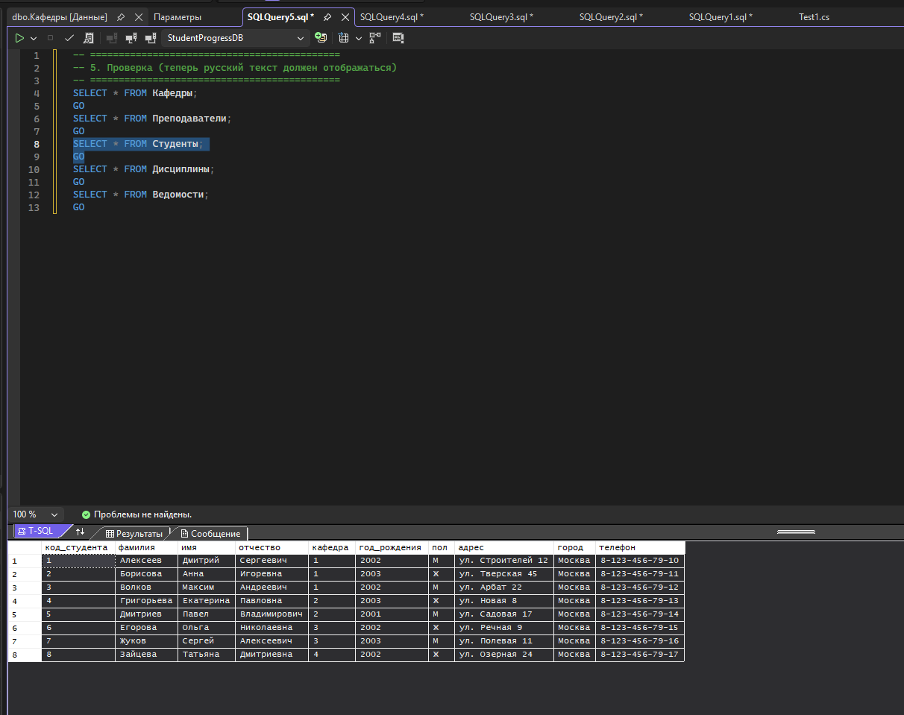
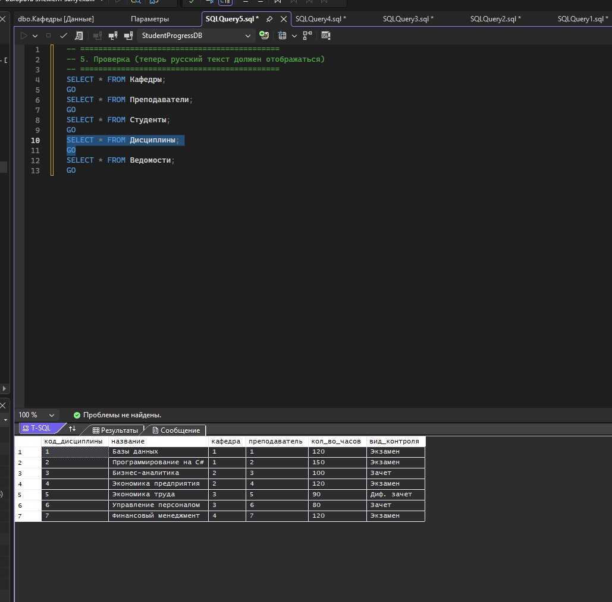
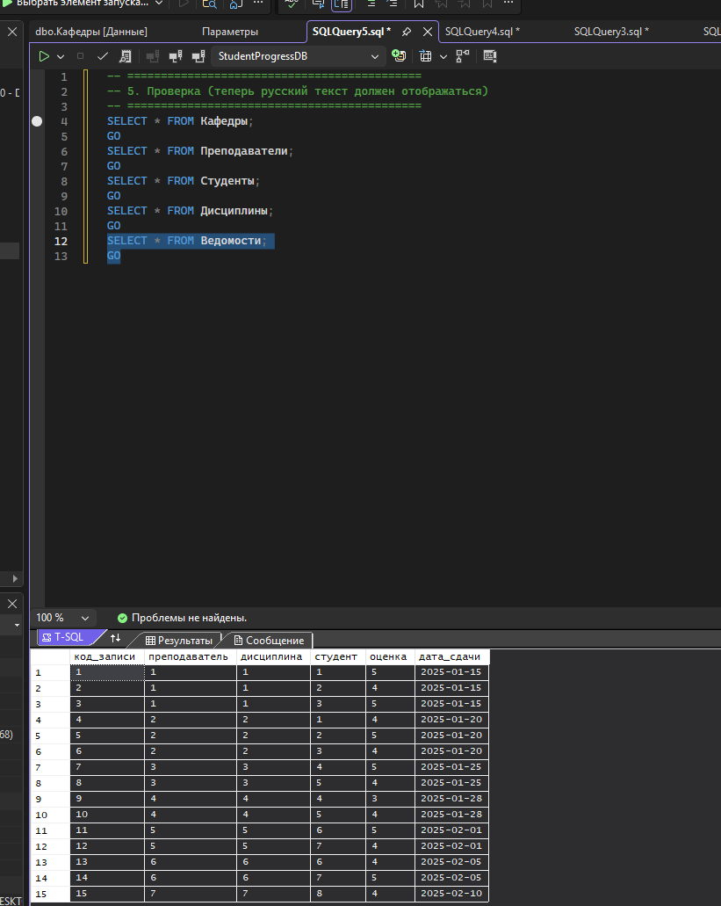
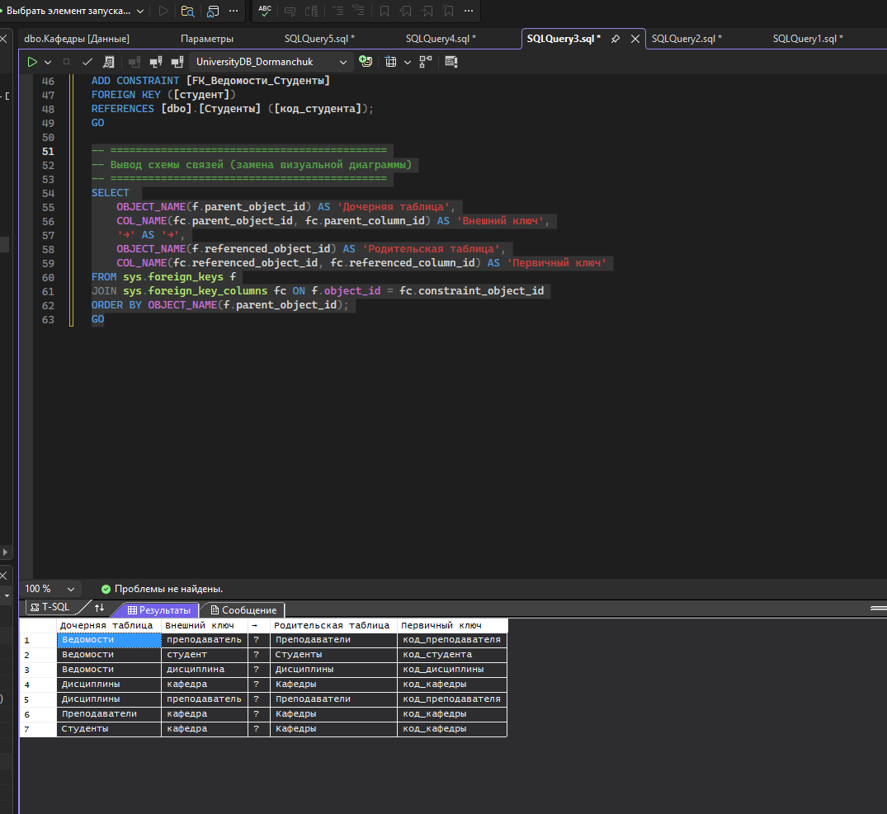

Создание базы

```SQL
CREATE DATABASE UniversityDB_Dormanchuk
ON PRIMARY
(
    NAME = UniversityDB_Dormanchuk_data,
    FILENAME = 'C:\Users\kosad\Desktop\Лабы 2026 C#\lab_C#\lab1\UniversityDB_Dormanchuk_data.mdf',
    SIZE = 10MB,
    MAXSIZE = 100MB,
    FILEGROWTH = 5MB
)
LOG ON
(
    NAME = UniversityDB_Dormanchuk_log,
    FILENAME = 'C:\Users\kosad\Desktop\Лабы 2026 C#\lab_C#\lab1\UniversityDB_Dormanchuk_log.ldf',
    SIZE = 5MB,
    MAXSIZE = 50MB,
    FILEGROWTH = 1MB
)
```

Таблицы
```SQL
-- ============================================
-- Таблица 1: Кафедры
-- ============================================
CREATE TABLE [dbo].[Кафедры] (
    [код_кафедры]        INT IDENTITY(1,1) NOT NULL,
    [название]           VARCHAR(100) NOT NULL,
    [факультет]          VARCHAR(100) NOT NULL,
    [фио_заведующего]    VARCHAR(150) NOT NULL,
    [номер_комнаты]       INT NOT NULL,
    [номер_корпуса]       INT NOT NULL,
    [телефон]            VARCHAR(20) NOT NULL,
    [кол_во_преподавателей] INT NOT NULL DEFAULT 0,
    CONSTRAINT [PK_Кафедры] PRIMARY KEY ([код_кафедры])
);
GO

-- ============================================
-- Таблица 2: Преподаватели
-- ============================================
CREATE TABLE [dbo].[Преподаватели] (
    [код_преподавателя]      INT IDENTITY(1,1) NOT NULL,
    [фамилия]                VARCHAR(50) NOT NULL,
    [имя]                    VARCHAR(50) NOT NULL,
    [отчество]               VARCHAR(50) NULL,
    [кафедра]                INT NOT NULL,  -- ссылка на кафедру
    [год_рождения]           INT NOT NULL,
    [год_поступления]        INT NOT NULL,
    [стаж]                   INT NOT NULL DEFAULT 0,
    [должность]              VARCHAR(100) NOT NULL,
    [пол]                    CHAR(1) NOT NULL CHECK (пол IN ('М', 'Ж')),
    [адрес]                  VARCHAR(200) NULL,
    [город]                  VARCHAR(50) NOT NULL,
    [телефон]                VARCHAR(20) NOT NULL,
    CONSTRAINT [PK_Преподаватели] PRIMARY KEY ([код_преподавателя])
);
GO

-- ============================================
-- Таблица 3: Студенты
-- ============================================
CREATE TABLE [dbo].[Студенты] (
    [код_студента]       INT IDENTITY(1,1) NOT NULL,
    [фамилия]            VARCHAR(50) NOT NULL,
    [имя]                VARCHAR(50) NOT NULL,
    [отчество]           VARCHAR(50) NULL,
    [кафедра]            INT NOT NULL,  -- ссылка на кафедру
    [год_рождения]       INT NOT NULL,
    [пол]                CHAR(1) NOT NULL CHECK (пол IN ('М', 'Ж')),
    [адрес]              VARCHAR(200) NULL,
    [город]              VARCHAR(50) NOT NULL,
    [телефон]            VARCHAR(20) NOT NULL,
    CONSTRAINT [PK_Студенты] PRIMARY KEY ([код_студента])
);
GO

-- ============================================
-- Таблица 4: Дисциплины
-- ============================================
CREATE TABLE [dbo].[Дисциплины] (
    [код_дисциплины]     INT IDENTITY(1,1) NOT NULL,
    [название]           VARCHAR(100) NOT NULL,
    [кафедра]            INT NOT NULL,  -- ссылка на кафедру
    [преподаватель]      INT NOT NULL,  -- кто читает (ссылка на преподавателя)
    [кол_во_часов]       INT NOT NULL,
    [вид_контроля]       VARCHAR(50) NOT NULL CHECK (вид_контроля IN ('Экзамен', 'Зачет', 'Диф. зачет')),
    CONSTRAINT [PK_Дисциплины] PRIMARY KEY ([код_дисциплины])
);
GO

-- ============================================
-- Таблица 5: Ведомости успеваемости
-- ============================================
CREATE TABLE [dbo].[Ведомости] (
    [код_записи]         INT IDENTITY(1,1) NOT NULL,
    [преподаватель]      INT NOT NULL,  -- ссылка на преподавателя
    [дисциплина]         INT NOT NULL,  -- ссылка на дисциплину
    [студент]            INT NOT NULL,  -- ссылка на студента
    [оценка]             INT NOT NULL CHECK (оценка BETWEEN 2 AND 5),
    [дата_сдачи]         DATE NOT NULL DEFAULT GETDATE(),
    CONSTRAINT [PK_Ведомости] PRIMARY KEY ([код_записи])
);
GO
```
СВЯЗИ
```SQL
-- ============================================
-- Связи для таблицы Преподаватели
-- ============================================
ALTER TABLE [dbo].[Преподаватели] 
ADD CONSTRAINT [FK_Преподаватели_Кафедры] 
FOREIGN KEY ([кафедра]) 
REFERENCES [dbo].[Кафедры] ([код_кафедры])
ON UPDATE CASCADE;

-- ============================================
-- Связи для таблицы Студенты
-- ============================================
ALTER TABLE [dbo].[Студенты] 
ADD CONSTRAINT [FK_Студенты_Кафедры] 
FOREIGN KEY ([кафедра]) 
REFERENCES [dbo].[Кафедры] ([код_кафедры])
ON UPDATE CASCADE;

-- ============================================
-- Связи для таблицы Дисциплины
-- ============================================
ALTER TABLE [dbo].[Дисциплины] 
ADD CONSTRAINT [FK_Дисциплины_Кафедры] 
FOREIGN KEY ([кафедра]) 
REFERENCES [dbo].[Кафедры] ([код_кафедры]);

ALTER TABLE [dbo].[Дисциплины] 
ADD CONSTRAINT [FK_Дисциплины_Преподаватели] 
FOREIGN KEY ([преподаватель]) 
REFERENCES [dbo].[Преподаватели] ([код_преподавателя]);

-- ============================================
-- Связи для таблицы Ведомости
-- ============================================
ALTER TABLE [dbo].[Ведомости] 
ADD CONSTRAINT [FK_Ведомости_Преподаватели] 
FOREIGN KEY ([преподаватель]) 
REFERENCES [dbo].[Преподаватели] ([код_преподавателя]);

ALTER TABLE [dbo].[Ведомости] 
ADD CONSTRAINT [FK_Ведомости_Дисциплины] 
FOREIGN KEY ([дисциплина]) 
REFERENCES [dbo].[Дисциплины] ([код_дисциплины]);

ALTER TABLE [dbo].[Ведомости] 
ADD CONSTRAINT [FK_Ведомости_Студенты] 
FOREIGN KEY ([студент]) 
REFERENCES [dbo].[Студенты] ([код_студента]);
GO
```

Диограмма
```SQL

-- ============================================
-- Вывод схемы связей (замена визуальной диаграммы)
-- ============================================
SELECT 
    OBJECT_NAME(f.parent_object_id) AS 'Дочерняя таблица',
    COL_NAME(fc.parent_object_id, fc.parent_column_id) AS 'Внешний ключ',
    '→' AS '→',
    OBJECT_NAME(f.referenced_object_id) AS 'Родительская таблица',
    COL_NAME(fc.referenced_object_id, fc.referenced_column_id) AS 'Первичный ключ'
FROM sys.foreign_keys f
JOIN sys.foreign_key_columns fc ON f.object_id = fc.constraint_object_id
ORDER BY OBJECT_NAME(f.parent_object_id);
GO
```








